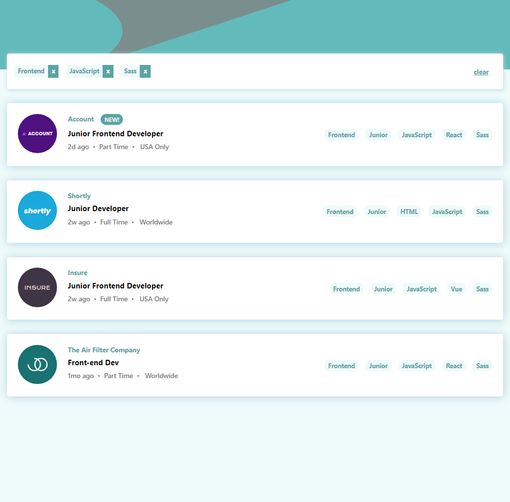
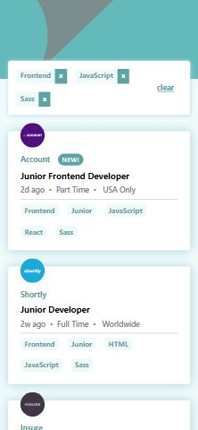

# Frontend Mentor - Job listings with filtering solution

This is a solution to the [Job listings with filtering challenge on Frontend Mentor](https://www.frontendmentor.io/challenges/job-listings-with-filtering-ivstIPCt). Frontend Mentor challenges help you improve your coding skills by building realistic projects.

## Table of contents

- [Overview](#overview)
  - [The challenge](#the-challenge)
  - [Screenshot](#screenshot)
  - [Links](#links)
- [My process](#my-process)
  - [Built with](#built-with)
  - [What I learned](#what-i-learned)
  - [Useful resources](#useful-resources)
- [Author](#author)

**Note: Delete this note and update the table of contents based on what sections you keep.**

## Overview

### The challenge

Users should be able to:

- View the optimal layout for the site depending on their device's screen size
- See hover states for all interactive elements on the page
- Filter job listings based on the categories

### Screenshot

### Links

- Solution URL: [My Solution](https://www.frontendmentor.io/solutions/job-listings-with-filtering-qdXUCFxlcY)
- Live Site URL: [live site](https://myjob-listing-filter.netlify.app/)

## My process

### Built with

- [React](https://reactjs.org/) - JS library
- Semantic HTML5 markup
- Vanilla CSS/SASS
- Flexbox
- CSS Grid

### What I learned

- By looking at other people's solution, I learned expected behavior when clicking the button to filter, which is inclusive filter
- Use of useContext hook in react for global state management
- Use of css grid and media query for mobile screen
- SASS can nest the css properties

### Useful resources

- [grid tips for different screen sizes](https://www.youtube.com/watch?v=705XCEruZFs) - This helped me for my project. I really liked this pattern and will use it going forward.
- [Mastering css grid](https://appbrewery.github.io/css-display/) - This is an amazing free course by Colt Steele, my dear sensei.

## Author

- Website - [Mami Nishiwaki](https://mami-portfolio.netlify.app)
